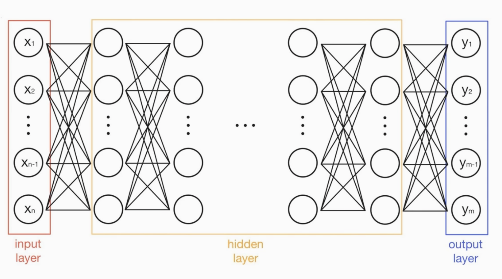

# 1. 딥러닝이란

## 1-2. 들어가며
**Contents**</br>

**01** 인공신경망</br>
1. 인공신경망 정의
2. 신경 세포
3. 인공 뉴런
4. 인공신경망 구조

**02** 인공신경망 역사</br>
1. 최초의 인공신경망
2. 퍼셉트론
3. 다중 퍼셉트론
4. 역전파 알고리즘

**03** 딥러닝 역사</br>
1. 인공신경망과 딥러닝
2. 기울기 소멸 문제
3. 과적합
4. 딥러닝의 발전

## 1-3. 인공신경망
01 인공신경망</br>
1. 인공신경망(Artificial Neural Network) 정의

</br>

---

[Learning Paradigms in Neural Networks](https://medium.com/swlh/learning-paradigms-in-neural-networks-30854975aa8d)</br>
[Keras Tutorial: Deep Learning in Python](https://www.datacamp.com/tutorial/deep-learning-python)</br>

- **인간 두뇌에 대한 계산적 모델**을 통해 인공지능을 구현하려는 분야
- **인간의 뇌 구조 모방**: 뉴런과 뉴런 사이에는 전기신호를 통해 정보를 전달
- 인간의 뉴런 구조와 활성화 작동원리를 모방
    - 자극(input)과 반응(output)의 연관으로 구현

</br>01 인공신경망</br>
2. 신경(Neural) 세포

- **수상돌기(Dendrite)**: 다른 신경세포의 축색돌기와 연결되어 전기화학적 신호를 받아들이는 부위
- **축색돌기(Axon)**: 수신한 전기/화학적 신호의 합성결과값이 특정 임계값 이상이면 신호를 보내는 부위
- **신경면접(Synapse)**: 수상돌기와 축색돌기 연결부, 전달되는 신호의 증폭 또는 감쇄

</br>01 인공신경망</br>
3. 인공 뉴런 (Artificial Neuron)

- 신경세포 구조를 단순화하여 모델링한 구조
- **노드(node)**와 **엣지(edge)**로 표현
- **선형구조(linear)**
    - 하나의 노드안에서 **입력(input)**과 **가중치(weight)**를 곱하고 더하는 형태의 구조를 띔
- **활성화 함수(activation function)**을 통해 **비선형 구조(Non-Linear)** 표현 가능

</br>01 인공신경망</br>
4. 인공신경망 구조

</br>

- 여러 개의 인공뉴런들이 모여 연결된 형태
- **층(layer)**: 뉴런들이 모인 하나의 단위
    - **여러 층(multi layer)**으로 이루어질 수 있음
- 신경망 계층의 예시
    - 입력층 (input layer)
    - 은닉층 (hidden layer)
    - 출력층 (output layer)

&nbsp;
```text
[연습퀴즈]

Q. 인공신경망(Artificail Neural Network)은 인간의 뇌에서 어떤 부분을 모방해 구현하나요?

A. 인간의 두뇌, 그중에서도 신경 세포의 구조와 동작을 모방하여 구현했습니다.

-------------------------------------------

Q. 신경 세포(Neuron)와 인공 뉴런(Artificial Neuron)은 동작 혹은 구조적으로 어떤 부분이 닮았나요?

A. 여러 신호를 받아 하나의 신호를 흘려주는 동작과 각각이 세포 혹은 노드 단위로 작동하는 구조가 닮았습니다. 또한 신호를 그대로 흘려보내는 것이 아니라 보내지 않을 수도 있고 혹은 다른 크기로 보내는 것이 닮았습니다.

-------------------------------------------

Q. 인공신경망은 여러 층으로 이루어질 수 있습니다. 실제 신경망과는 어떤 차이가 있을까요?

A. 일반적으로 인공신경망은 layer 단위로 순차적으로 쌓이는 구조를 띄지만 실제 신경망은 layer 단위에 구속되지 않고 연결할 수 있습니다.
```

&nbsp;
## 1-4. 인공신경망 역사

</br>

02 인공신경망 역시</br>
1. 최초의 인공신경망

</br>

- **인간의 신경계를 활성 상태와 비활성 상태를**갖는 **이진 뉴런**으로 표현
- 생체 뉴런과 같은 방식을 차용
    - 시냅스의 흥분과 억제에 따라 신호가 전달
    - 특정 임계치가 넘어야 신호가 발화

</br>02 인공신경망 역사</br>
2. 퍼셉트론 (Perceptron)

</br>

- **프랭크 로젠블랫(Frank Rosenblatt)**이 개발
    - **헵 가설**에 따라 **인공신경망이 스스로 문제에 맞춰 학습**하는 방식을 적용

</br>퍼셉트론 vs 생체신경망</br>

|분류|퍼셉트론|생체신경망|
|---|------|-------|
|입력|$x^{T}=(x_{1}.x_{2}. ... .x_{n})$|이전 뉴런이 발화한 신호|
|가중치|$w^{T}=(w_{1}.w_{2}. ... .w_{n})$|시냅스의 연경강도|
|입력과 가중치 곱|$w_{i}x_{i}=(i=1,2,...,n)$|시냅스의 연결 강도에 따라 신호가 강해지거나 약해지는 과정|
|가중 합산|$z=\displaystyle\sum_{i=1}^{n}w_{i}x_{i}+b$|세포체에서 수상 돌기를 통해 들어온 신호를 모으는 과정|
|활성 함수|$f(x)=\begin{cases}1, if z \geq0\\0,otherwise\end{cases}$|세포체의 신호 발화 과정|
|출력|$f(x) = f(w^{T}x+b)$|축삭을 따라 시냅스로 전달되는 과정|

&nbsp;
</br>

**마빈 민스키(Marvin Lee Minsky)**와 **시모어 페퍼트(Seymour Papert)**는 **퍼셉트론**이 **비선형 문제**를 해결할 수 없음을 증명함 (XOR, NXOR)</br>

&nbsp;
</br>

퍼셉트론으로 두 개 이상의 직선을 표현하는 방법을 연구</br>
- **AND 연산**이 필요함을 알게됨
- 연산을 수행하기 위해 여러 개의 계층으로 퍼셉트론을 표현하기 시작함
- **다층 퍼셉트론(Multi Layer Perceptron, MLP)** 개념 탄생

</br>02 인공신경망 역시</br>
3. 다층 퍼셉트론 (Multi-layer Perceptron, MLP)


</br>

**여러 개의 퍼셉트론을 층으로 구성한 신경망 모델**
- MLP는 학습하기 어렵다
    - 활성화 함수가 **계단 함수**
        - **미분이 불가능**
    - 미분 가능한 함수가 필요함

</br>02 인공신경망 역시</br>
4. 역전파 알고리즘 (Backpropagation)

</br>

**폴 워보스(Paul Werbos)**가 처음 발표
- 1982년, 학위논문

**데이비드 파커(David Parker), 얀 르쿤(Yann Le Cun)**
- 1985년, 역전파 알고리즘을 제안

**데이비드 루멜하트(David Rumelhart), 제임스 매클랠런드(James McClelland), 제프리 힌턴(Geoffrey Hinton), 로널드 윌리엄스(Ronald Williams)**
- 1986년, 역전파 알고리즘 공개

&nbsp;
```text
[연습퀴즈]

Q. 퍼셉트론에서는 활성화 함수를 통해 받아들인 정보를 전달할 수도 전달하지 않을 수도 있습니다. 이를 신경세포의 어떤 과정을 모방한 것일까요?

A. 세포체의 신호 발화 과정을 모방했습니다.

-----------------------------------------

Q. 영상에 등장하진 않았지만 다른 논리회로 게이트 종류도 많습니다. 다른 논리 회로 게이트 중에서도 단일 퍼셉트론으로는 해결할 수 없는 것들이 있을까요?

A. XOR 게이트의 반전 형태인 XNOR 게이트가 있습니다. XNOR 게이트는 입력 받은 데이터가 같으면 1, 다르면 0을 출력합니다.

-----------------------------------------

Q. 다층 퍼셉트론을 학습시키는것이 어려운 이유는 무엇일까요?

A. 많은 은닉층의 수와 미분이 불가능한 계단함수의 존재가 학습의 난이도를 높입니다.
```

&nbsp;
## 1-5. 딥러닝 역사

&nbsp;
## 1-6. 마무리하며