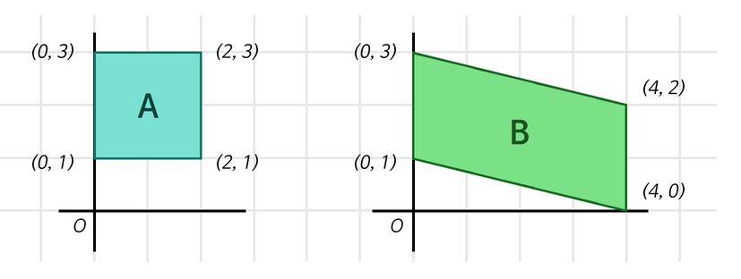
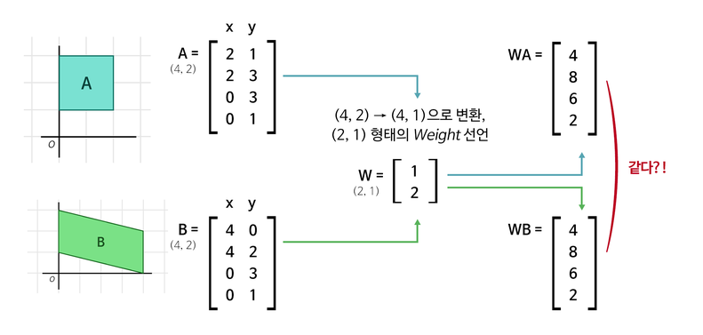
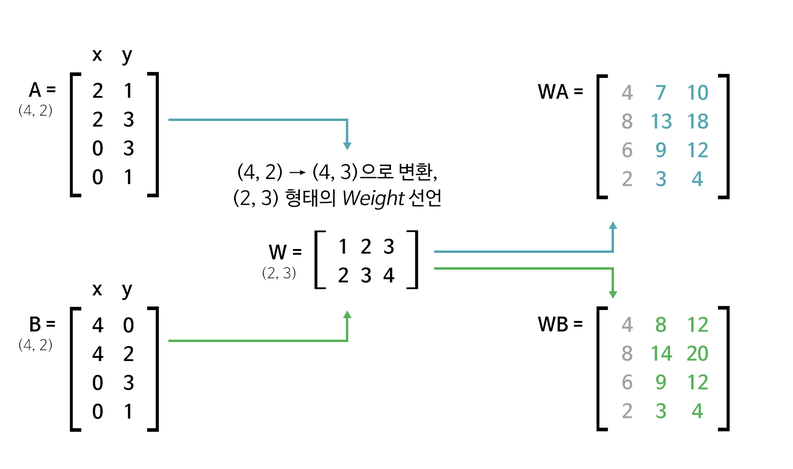
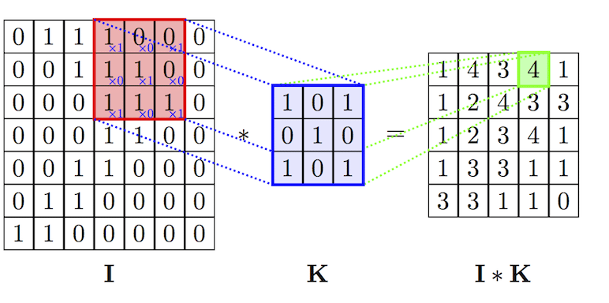
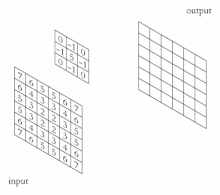
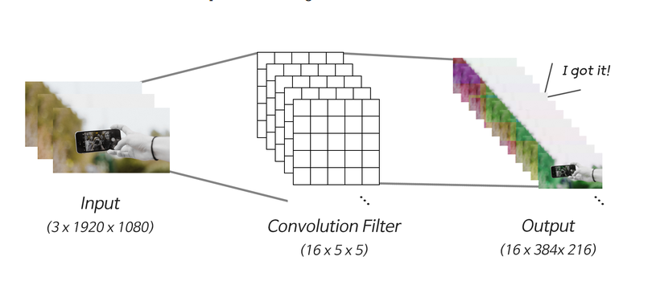
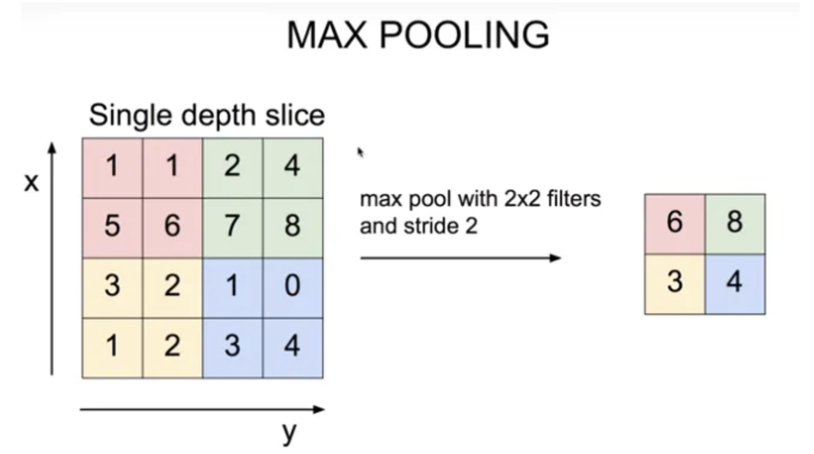

# 딥러닝 레이어의이해(1), Linear, Convolution
## 1. 데이터의 형태
|이름|나이|성별|관심분야|홈페이지|이메일|
|---|---|---|---|---|---|
|홍길동|28|남|자연어 처리|gildong.modulab.com|gdh@modulab.com|
|김영희|27|여|영상 처리|yhkim.modulab.com|yoong@modulab.com|
|제임스|32|남|IOS 개발|james.modulab.com|jms152@modulab.com|
---
위와 같은 형태의 표 데이터는 **(3,6)**의 매트릭스로 표현이 가능하다.
<html>
    <table>
        <tr>
            <td>기업</td>
            <td>이름</td>
            <td>나이</td>
            <td>성별</td>
            <td>관심분야</td>
            <td>홈페이지</td>
            <td>이메일</td>
        </tr>
        <tr>
            <td rowspan="3">기업 A</td>
            <td>홍길동</td>
            <td>28</td>
            <td>남</td>
            <td>자연어 처리</td>
            <td>gildong.modulab.com</td>
            <td>gdh@modulab.com</td>
        </tr>
        <tr>
            <!-- 병합한 row는 생략 -->
            <td>김영희</td>
            <td>27</td>
            <td>여</td>
            <td>영상 처리</td>
            <td>yhkim.modulab.com</td>
            <td>yooong@modulab.com</td>
        </tr>
        <tr>
            <!-- 병합한 row는 생략 -->
            <td>제임스</td>
            <td>32</td>
            <td>남</td>
            <td>IOS 개발</td>
            <td>james.modulab.com</td>
            <td>jms152@modulab.com</td>
        </tr>
        <tr>
            <td rowspan="3">기업 B</td>
            <td>박길동</td>
            <td>27</td>
            <td>남</td>
            <td>서버 관리</td>
            <td>gbpark.modulab.com</td>
            <td>gdp02@modulab.com</td>
        </tr>
        <tr>
            <!-- 병합한 row는 생략 -->
            <td>최영희</td>
            <td>26</td>
            <td>여</td>
            <td>웹 개발</td>
            <td>yhch.modulab.com</td>
            <td>yhch@modulab.com</td>
        </tr>
        <tr>
            <!-- 병합한 row는 생략 -->
            <td>김임스</td>
            <td>33</td>
            <td>남</td>
            <td>디자이너</td>
            <td>kimes.modulab.com</td>
            <td>kimes77@modulab.com</td>
        </tr>
    </table>
</html>

---
만약 위의 테이블처럼 기업 B의 데이터가 추가된다면 **(2,3,6)**의 매트릭스로 표현가능하다.

이미지 데이터의 경우 색 데이터를 표현하기 위해 매트릭스 표현 시 채널(channel) 항목을 가진다.</br>
비디오 데이터의 경우 영상 러닝 타임의 정보를 매트릭스에 같이 표현하며 시간은 **초(second)** 단위로 표현한다.

---
```text
Q. 해상도가 1280 x 1024(30fps)이고 러닝타임(T)이 90분인 흑백영화 데이터를 매트릭스 형태로 표현하시오.
단, 표기는 (T, C, H, W)의 형식으로 정한다.

A. (162000, 1, 1024, 1280)
```

&nbsp;
## 2. 레이어는 어렵다?
### *Layer?*
```text
여러 개의 논리적인 개체가 층을 이루어서 하나의 물체를 구성하는 경우, 각각의 개체를 하나의 레이어라 한다.
```
이미지 처리(**Image Processing**)에서 레이어는 일반적으로 하나의 이미지를 여러 elements로 나누었을 때 element 각각을 의미한다. &nbsp;
[Wiki](en.wikipidia.org/wiki/Layers_(ditigal_image_editing))

&nbsp;
## 3. 딥러닝의 근본! Linear 레이어
```text
딥러닝에서 쓰이는 다양한 레이어들 (Fully Connected Layer, Feedforword Neural Network, Multilayer Perceptrons, Dense Layer, .etc)은 근본적으로 Linear 레이어에 해당한다.

Linear Layer가 수행하는 기능은 선형대수학에서의 선형 변환(Linear Transform)과 동치(equivalant)한다.
```
---
&nbsp;</br>
[Video1-Linear transformations and matrics](https://www.youtube.com/watch?v=kYB8IZa5AuE&ab_channel=3Blue1Brown)</br>
[Video2-행렬과 선형변환(feat.마인크래프트 스티브](https://www.youtube.com/watch?v=vVvjYzFBUVk&ab_channel=%EC%83%81%EC%9A%B0%EC%8C%A4%EC%9D%98%EC%88%98%ED%95%99%EB%85%B8%ED%8A%B8)</br>

### 두 사각형이 다음과 같이 주어질 때, 사각형 점 정보를 집약된 하나의 정수로 표현해보자 (데이터 집약 예시)
<!-- 그림1 -->


```text
1. 사각형 A는 (x, y)의 좌표를 4개 가지고 있으므로 (4,2) 매트릭스로 표현가능하다.
2. 1번 매트릭스 정보를 하나의 정수로 표현하기 위해서 매트릭스를 1차원으로 집약(squeeze)하자.

<식1>
- 1단계: (4,2) x (2, 1) = (4, )
- 2단계: (4, ) x (4, 1) = (1, )
```

위 과정을 수행하고 나면 각각의 사각형을 정보가 집약된 하나의 정수로 표현할 수 있다.</br>
`식1`에 사용된 각각의 행렬들(`(2, 1), (4, 1)`)이 **Weight**며, Linear Layer는`(입력의 차원, 출력의 차원)`의 형태로 weight를 가지는 특성이 있다.

#### ***<식1> 각 단계를 python code로 구현한 예시***
```python
import tensorflow as tf

batch_size = 64
boxes = tf.zeros((batch_size, 4, 2))

# Tensorflow는 Batch를 기반으로 동작
# boxs에는 사각형 2개 세트를 batch_size개 만큼 생성

print("1단계 연산 준비:", boxes.shape)

first_linear = tf.keras.layers.Dense(units=1, use_bias=False)
# units는 출력 차원의 수

first_out = first_linear(boxes)
first_out = tf.squeeze(first_out, axis=-1)  # (4, 1)을 (4, )로 축소; 불필요한 차원 축소

print(f"1단계 연산 결과: {first_out.shape}")
print(f"1단계 Linear Layer의 Weight 형태: {first_linear.weights[0].shape}")
print(f"1단계 Linear Layer의 파라미터개수: {first_linear.count_params()}")
print(f"\n2단계 연산 준비: {first_out.shape}")

second_linear = tf.keras.layers.Dense(units=1, use_bias=False)
second_out = second_linear(first_out)
second_out = tf.squeeze(second_out, axis=1)

print(f"2단계 연산 결과: {second_out.shape}")
print(f"2단계 Linear Layer의 Weight 형태: {second_linear.weights[0].shape}")
print(f"2단계 Linear Layer의 파라미터개수: {second_linear.count_params()}")
```
```shell
# 실행 결과
1단계 연산 준비: (64, 4, 2)
1단계 연산 결과: (64, 4)
1단계 Linear Layer의 Weight 형태: (2, 1)
1단계 Linear Layer의 파라미터개수: 2

2단계 연산 준비: (64, 4)
2단계 연산 결과: (64, )
2단계 Linear Layer의 Weight 형태: (4, 1)
2단계 Linear Layer의 파라미터개수: 4
```
<!-- 그림2 -->


코드 결과가 의미하는 바는 위 그림과 같다. 이런 경우 `<식1>`의 1단계 연산 결과와 2단계 연산 준비 단계가 동일해져 `(4,1)` weight를 거치는게 의미가 없다.
```text
Tip. Weight의 모든 요소를 Parameter라고 한다.

위 케이스의 총 파라미터는 (4, 1), (2, 1)에 기반하여 6이 나오는데 다음과 같은 방법으로 계산된다.

총 파라미터 개수 = (4 x 1) + (2 x 1) = 4 + 2
```
---
### 두 사각형이 다음과 같이 주어질 때, 사각형 점 정보를 집약된 하나의 정수로 표현해보자 (데이터 가중 예시)
```text
1. 사각형 A는 (x, y)의 좌표를 4개 가지고 있으므로 (4,2) 매트릭스로 표현가능하다.
2. 1번 매트릭스 데이터를 풍부하게 하기위해 다음 식을 구성해보자

<식2>
- 1단계: (4,2) x (2, 3) = (4, 3)
- 2단계: (4, 3) x (3, 1) = (3, )
- 3단계: (4, ) x (4, 1) = (1, )
```
---
<!-- 그림3 -->


`<식2>`의 1단계 작업 후 각 사각형에 대해 독립적인 정보가 생성된다. 이후 단계를 거쳐 `<식1>`에 비해 더 많은 사각형을 구분할 수 있다.
```text
Q. <식2>에서 사용된 총 Parameter 개수는?

A. 13개

* 총 파라미터 개수 = 1단계 weight의 elements 곱 + 2단계 weight elements 곱 + 3단계 weight elements 곱 = (2 * 3) + (3 * 1) + (4 * 1)
```
---
#### ***<식2> 각 단계를 python code로 구현한 예시***
```python
import tensorflow as tf

batch_size = 64
boxes = tf.zeros((batch_size, 4, 2))

print(f"1단계 연산 준비: {boxes.shapge}")

# Step 1: (4, 2) 차원인 boxes를 (4,3)으로 확장시키기
first_linear = tf.keras.layers.Dense(units=1, use_bias=False)
first_out = first_linear(boxes)
first_out = tf.expand_dims(first_out, axis=0)   # (4, 2)를 (4,3)으로 변환

print(f"1단계 연산 결과: {first_out.shape}")
print(f"1단계 Linear Layer의 Weight 형태: {first_linear.weights[0].shape}")
print(f"\n2단계 연산 준비: {first_out.shape}")

# Dense = Linear
second_linear = tf.keras.layer.Dense(units=1, use_bias=False)
second_out = second_linear(first_out)
second_out = tf.squeeze(second_out, axis=-1)

print(f"2단계 연산 결과: {second_out.shape}")
print(f"2단계 Linear Layer의 Weight 형태: {second_linear.weights[0].shape}")
print(f"\n3단계 연산 준비: {second_out.shape}")

# Step 2: 4차원인 second_out을 하나의 실수로 집약시키는 Linear Layer 수행하기
third_linear = tf.keras.layers.Dense(units=1, use_bias=False)
third_out = third_linear(second_out)
third_out = tf.squeeze(third_out, axis=-1)

print(f"3단계 연산 결과: {third_out.shape}")
print(f"3단계 Linear Layer의 Weight 형태: {third_linear.weights[0].shape}")

# Step 3: 모든 params를 더해보자
total_params = first_linear.count_params() + second_linear.count_params() + third_linear.count_params()
print(f"\n총 Parameters: {total_params}")
```
```shell
1단계 연산 준비: (64, 4, 2)
1단계 연산 결과: (1, 64, 4, 1)
1단계 Linear Layer의 Weight 형태: (2, 1)

2단계 연산 준비: (1, 64, 4, 1)
2단계 연산 결과: (1, 64, 4)
2단계 Linear Layer의 Weight 형태: (1, 1)

3단계 연산 준비: (1, 64, 4)
3단계 연산 결과: (1, 64)
3단계 Linear Layer의 Weight 형태: (4, 1)

총 Parameters: 7
```
---
```text
** Tips **
1. 지나치게 많은 Parameter는 과적합(Overfitting)을 야기한다.
2. 훈련(Training)이란 주어진 Weight를 기반으로 weight의 파라미터 값을 임의의 실수로 채우고 수많은 데이터를 거쳐 가장 적합한 weight를 알아서 찾아가는 과정
    - 적합한 파라미터는 주어진 데이터의 분포에 달려있다.

3. 편향(bias)은 모델을 통해 얻은 예측값과 실제 정답과의 차이의 평균
```
---
[Bias와 Variance](https://gaussian37.github.io/machine-learning-concept-bias_and_variance/)</br>

&nbsp;
## 4. 정보를 집약시키자! Convolution 레이어
<!-- 그림4 -->


위 그림을 Linear 레이어를 활용해서 데이터를 핸들링하면 다음과 같은 계산 과정이 도출된다.
```text
<식3>
- 1단계: (1920, 1080, 3) --> (1, 1920 x 1080 x 3)
- 2단계: (1, 6220800) x (6220800, ) = (1, )
```
---
기존 Linear Layer 방식으로 고해상도 이미지를 처리 시 Parameter 수가 최소 600만개 생성되므로 원하는 이미지(`손`)를 추출할 때, 모든 픽셀을 살펴 효율성이 떨어진다.</br>

### Convolution Layer
Linear Layer의 단점을 보완하기 위해 고안된 Layer 기법
<!-- 그림5 -->


---
[Image Processing에서의 Kernel](https://en.wikipedia.org/wiki/Kernel_(image_processing))
```text
이미지(I)를 필터(K)로 훑으며 필터와 이미지가 겹치는 부분의 각 픽셀들을 곱하여 더하는 것이 convolution 연산이다.

이미지를 훑기 위해 이동하는 단위를 Stride라고 한다. Stride가 1이면 필터를 이미지의 (0, 0)에서부터 1 픽셀씩 이동(shifting)한다.
```
<!-- 그림5 gif -->


---
#### Convolution 과정에 필수적인 Padding
[그래서 Padding을 왜함?](https://brunch.co.kr/@coolmindory/37)</br>
&nbsp;</br>
```text
이미지를 convolution filter만으로 이미지 처리를 하면 원본 이미지가 작아진다.

위 경우를 설명해주는 수식
이미지 사이즈는 n * n, 필터 사이즈는 f * f 라고 가정함

Convolution Filter Result = (n - f + 1) * (n - f + 1) = (n - f + 1)^2
```
즉 Padding은 convolution 과정에서 이미지의 손실을 방지하기 위해 사용되는 기법이다.</br>

---
<!-- 그림 6 -->


```text
<식4>
1단계: (1920, 1080, 3) * (3, 16, 5, 5) Stride5 = (384, 216, 16)
2단계: (384, 216, 16) --> (1, 384 x 216 x 16)
3단계: (1, 1327104) x (1327104, ) = (1, )

(* 기호는 Convolution 연산을 의미)
```
`<식4>`의 경우 입력 데이터 대비 필터 사이즈가 `5x5`로 너무 작아 유의미한 필터링을 할 수 없다.</br>
입력의 크기를 줄이거나 필터의 크기를 키울 필요가 있다.</br>
**필터의 크기와 Stride를 같게**하면 손이 필터의 경계선에 걸릴 경우 손을 정상적으로 인식하지 못할 수 있다.</br>

---
#### ***<식4> 각 단계를 python code로 구현한 예시***
```python
import tensorflow as tf

batch size = 64
pic = tf.zeros((batch_size, 1920, 1080, 3))

print(f"입력 이미지 데이터: {pic.shape}")
conv_layer = tf.keras.layers.Conv2D(filters=16, kernel_size=(5,5), strides=5, use_bias=False)
conv_out = conv_layer(pic)

print(f"\nConvolution 결과: {conv_out.shape}")
print(f"Convolution Layer의 Parameter 수: {conv_layer.count_params()}")

flatten_out = tf.keras.layers.Flatten()(conv_out)
print(f"\n1차원으로 펼친 데이터: {flatten_out.shape}")

linear_layer = tf.keras.layers.Dense(units=1, use_bias=False)
linear_out = linear_layer(flatten_out)

print(f"\nLinear 결과: {linear_out.shape}")
print(f"Linear Layer의 Parameter 수: {linear_layer.count_params()}")
```
```shell
입력 이미지 데이터: (64, 1920, 1080, 3)

Convolution 결과: (64, 384, 216, 16)
Convolution Layer의 Parameter 수: 1200

1차원으로 펼친 데이터: (64, 1327104)

Linear 결과: (64, 1)
Linear Layer의 Parameter 수: 1327104
```

&nbsp;
## 5. 핵심만 추려서 더 넓게! Pooling 레이어
Convolution 필터링을 할 때, filter를 극단적으로 키울 경우 파라미터 사이즈와 연산량이 커진다.</br>
이로인해 Accuracy도 떨어지게 될 가능성이 높다.</br>

따라서 차원을 감소시키면서 filtering을 해야하는데 이때 사용하는 개념이 **Pooling layer**다.</br>

&nbsp;</br>
[참고링크](https://underflow101.tistory.com/41)

```text
Pooling Layer에는 Max Pooling과 Average Pooling이 있다.

1. Max Pooling: 필터(max pooling layer)의 영역에서 최대값을 찾는 방법
2. Average Pooling: 필터(average pooling layer) 영역의 평균값을 계산하는 방법

이 외에도 가중치 평균(Weight Average)풀링, L2 Norm 풀링 등이 있다.
```

<!-- 그림7 -->


### Receptive Field Size
원본 이미지를 필터로 걸러낸 결과 값을 뉴런이라고 한다.</br>
이 때, 뉴런이 원본 이미지에서 담당하는 범위를 **Receptive Field**라고 한다.

```text
Q. 필터 크기가 3 X 3이고 stride가 2인 convolution 레이어에 2 X 2 max pooling 레이어가 연결된 딥러닝 모델이 있습니다. 위 그림과 같은 max pooling 레이어를 통해 빨간색 포인트가 선택되었다면 max pooling 레이어의 output에서의 receptive field의 크기는 얼마일까요?

A. 위 그림에서는 빨간색, 녹색, 파란색, 하얀색 포인트가 가지는 Receptive Field의 영역 전체가 max pooling 레이어의 한 포인트의 Receptive Field가 되므로 이때는 5 X 5의 Receptive Field를 가지게 된다.
```

## 6. 집약된 정보의 복원! Transpose Convolution 레이어
---
### Auto encoder
원본 이미지를 Convolution 필터로 걸러낸 후, 이 결과를 역재생해서 **원본 이미지와 최대한 유사한 정보를 복원**해내는 과정을 담당한다.</br>

---
[참고링크-Autoencoder](https://excelsior-cjh.tistory.com/187)

아래는 MINIST 데이터셋을 기반으로 데이터를 복원하는 Auto Encoder 예시
```text
순서는 다음과 같습니다.

* 패키지 임포트 및 MINIST 데이터셋 로딩
* AutoEncoder 모델 구성
* AutoEncoder 모델 훈련
* AUtoEncoder Reconstruction Test
```
```python
# 패키지 임포트
import numpy as np
from tensorflow.keras.layers import Input, Dense, Conv2D, MaxPooling2D, UpSampling2D
from tensorflow.keras.models import Model
from tensorflow.keras.datasets import mnist
import json
import matplotlib.pyplot as plt # for plotting

# MINIST 데이터 로딩
(x_train, _), (x_test, _) = mnist.load_data()   # y_train, y_test는 사용하지 않음

x_train = np.expand_dims(x_train, axis=3)
x_test = np.expand_dims(x_test, axis=3)

x_train = x_train.astype('float32') / 255.
x_test = x_test.astype('float32') / 255.
```
```shell
# MINIST 데이터 로딩 실형 결과 예시
Downloading data from https://storage.googleapis.com/tensorflow/tf-keras-datasets/mnist.npz
11493376/11490434 [ ============================ ] - 0s 0us/step
11501568/11490434 [ ============================ ] - 0s 0us/step
```
```python
# AutoEncoder 모델 구성 - Input 부분
input_shape = x_train.shape[1:]
input_img = Input(shape=input_shape)

# AutoEncoder 모델 구성 - Encoder 부분
encode_conv_layer1 = Conv2D(16, (3, 3), activation='relu', padding='same')
encode_pool_layer1 = MaxPooling2D((2,2), padding='same')
encode_conv_layer2 = Conv2D(8, (3, 3), activation='relu', padding='same')
encode_pool_layer2 = MaxPooling2D((2,2), padding='same')
encode_conv_layer3 = Conv2D(4, (3, 3), activation='relu', padding='same')
encode_pool_layer3 = MaxPooling2D((2,2), padding='same')

encoded = encode_conv_layer1(input_img)
encoded = encoded_pool_layer1(encoded)
encoded = encode_conv_layer2(encoded)
encoded = encoded_pool_layer2(encoded)
encoded = encode_conv_layer3(encoded)
encoded = encoded_pool_layer3(encoded)

# AutoEncoder 모델 구성 - Decoder 부분
decode_conv_layer_1 = Conv2D(4, (3, 3), activation='relu', padding='same')
decode_upsample_layer_1 = UpSampling2D((2, 2))
decode_conv_layer_2 = Conv2D(8, (3, 3), activation='relu', padding='same')
decode_upsample_layer_2 = UpSampling2D((2, 2))
decode_conv_layer_3 = Conv2D(16, (3, 3), activation='relu')
decode_upsample_layer_3 = UpSampling2D((2, 2))
decode_conv_layer_4 = Conv2D(1, (3, 3), activation='sigmoid', padding='same')

# Decoder는 Encoder의 출력을 입력으로 받습니다.
decoded = decode_conv_layer1(encoded)
decoded = decode_upsample_layer_1(decoded)
decoded = decode_conv_layer2(decoded)
decoded = decode_upsample_layer_2(decoded)
decoded = decode_conv_layer3(decoded)
decoded = decode_upsample_layer_3(decoded)
decoded = decode_conv_layer4(decoded)

# AutoEncoder 모델 정의
autoencoder = Model(input_img, decoded)
autoencoder.summary()
autoencoder.complie(optimizer='adam', loss='binary_crossentropy')
```
```shell
# 실행 결과 예시
Model: "model"
#---------------------------------------------------------------
Layer (type)                    Output Shape            Param #
#===============================================================
input_1 (InputLayer)            [(None, 28, 28, 1)]     0
#---------------------------------------------------------------
conv2d (Conv2D)                 (None, 28, 28, 6)       160
#---------------------------------------------------------------
max_pooling2d (MaxPooling2D)    (None, 14, 14, 16)      0
#---------------------------------------------------------------
conv2d_1 (Conv2D)               (None, 14, 14, 8)       1160
#---------------------------------------------------------------
max_pooling2d_1 (MaxPooling2D)  (None, 7, 7, 8)         0
#---------------------------------------------------------------
conv2d_2 (Conv2D)               (None, 7, 7, 4)         292
#---------------------------------------------------------------
max_pooling2d_2 (MaxPooling2D)  (None, 4, 4, 4)         0
#---------------------------------------------------------------
conv2d_3 (Conv2D)               (None, 4, 4, 4)         148
#---------------------------------------------------------------
up_sampling2d (UpSampling2D)    (None, 4, 4, 4)         0
#---------------------------------------------------------------
conv2d_4 (Conv2D)               (None, 8, 8, 4)         296
#---------------------------------------------------------------
up_sampling2d_1 (UpSampling2D)  (None, 16, 16, 8)       0
#---------------------------------------------------------------
conv2d_5 (Conv2D)               (None, 14, 14, 16)      1168
#---------------------------------------------------------------
up_sampling2d_2 (UpSampling2D)  (None, 28, 28, 16)      0
#---------------------------------------------------------------
conv2d_6 (Conv2D)               (None, 28, 28, 1)       145
#===============================================================
Total params: 3,369
Trainable params: 3,369
Non-trainable params: 0
```
위 예시를 토대로 알 수 있는 부분은 다음과 같다. </br>

---
`Conv2D` 레이어는 shape를 변화시키지 않는다. </br>
`MaxPooling2D` 레이어가 Output shape를 변화시킨다 </br>

---

아래는 AutoEncoder 훈련 및 이미지 복원을 수행하는 예시 코드
```python
# AutoEncoder 훈련 부분
autoencoder.complie(optimizer='adadelta', loss='binary_crossentropy')

autoencoder.fit(x_tran, x_train, epochs=2, 
                batch_size=256, shuffle=True, 
                validation_data=(x_test, x_test))

# 1) 테스트 데이터셋에서 10개만 골라서 2) AutoEncoder 모델의 이미지 복원생성
x_test_10 = x_test[:10]
x_test_hat = autoencoder.predict(x_test_10)
x_test_imgs = x_test_10.reshape(-1, 28, 28)
x_test_hat_imgs = x_test_hap.reshape(-1, 28, 28)

# 이미지 사이즈 지정
plt.figure(figsize=(12,5))
for i in range(10):
    # 원본이미지 출력
    plt.subplot(2, 10, i+1)
    plt.imshow(x_test_imgs[i])
    # 생성된 이미지 출력
    plt.subplot(2, 10, i+11)
    plt.imshow(x_test_imgs[i])
```
```shell
# 훈련 결과 예시
Epoch 1/2
235/235 [ ======================= ] - 97s 403ms/step - loss: 0.6922 - val_loss: 0.6917
Epoch 2/2
235/235 [ ======================= ] - 95s 402ms/step - loss: 0.6912 - val_loss: 0.6906

<keras.callbacks.History at 0x7f09049379a0>
```
<!-- 그림8 -->

테스트 데이터셋 10개분의 이미지 복원 예시 결과

### Decoder Layers for Reconstruction
위의 예시는 Convolution의 수학적 역연산을 활용하여 이미지 복원을 테스트한 것이다.
```text
이미지 복원에는 Upsampling 레이어를 통해 필터링된 이미지를 복원한다.

Upsampling에는 크게 다음 3가지 방법이 있다.

* Nearest Neighbor: 복원해야 할 값을 가까운 값으로 복제
* Bed of Nails: 복원해야 할 값을 0으로 처리
* Max Unpooling: Max Pooling 때 버린 값을 따로 기억해두었다가 그 값으로 복원한다.
```
---
[Deconvoultion 참고](https://analysisbugs.tistory.com/104) </br>
[Transposed Convolution 참고](https://zzsza.github.io/data/2018/06/25/upsampling-with-transposed-convolution/)

---
