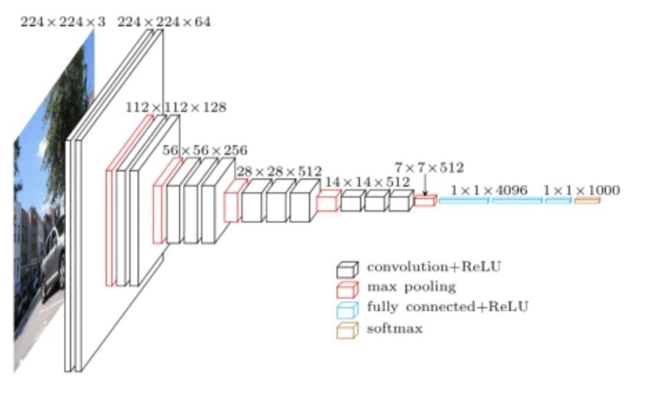

# 딥네트워크, 서로 뭐가 다른 거죠?
## 1. ImageNet Challenge
---
**이미지넷(ImageNet)**: ILSVRC2010 대회를 위해 처음 만들어진 대량의 이미지 데이터를 포함하는 데이터셋 </br>
### 이미지 분류 모델 평가 방법
1. Top-1 Error
2. Top-5 Error
```text
이미지를 분류할 때, 나오는 결과는 각각의 확률을 가지게끔 설정한다.

이 때, 가장 확률이 높은 결과 하나를 모델의 분류 정답으로 선택하는 방식을 Top-1 Error,
모든 결과 중 상위 5개의 고확률 결과를 모두 모델의 분류 정답으로 선택하는 방식을 Top-5 Error 라고 한다.
```
[개념 설명](https://bskyvision.com/422) </br>
[Stackoverflow](https://stackoverflow.com/questions/37668902/evaluation-calculate-top-n-accuracy-top-1-and-top-5) </br>
[(TED)How understand about the picture on computer?](https://www.youtube.com/watch?v=40riCqvRoMs&pp=ygUNdGVkIGZlaWZlaSBsaQ%3D%3D)</br>

## 2. 딥네트워크의 시작
[AlexNet의 구조](https://bskyvision.com/421) </br>
[(Paper)ImageNet Classfication with Deep Convolutional Neural Networks](https://proceedings.neurips.cc/paper_files/paper/2012/file/c399862d3b9d6b76c8436e924a68c45b-Paper.pdf) </br>

## 3. CNN을 잘쓰자
**VGG?** _Visual Geometry Group_</br>
</br>
작은 사이즈의 필터(3x3)를 여러번 사용하여 convolution 연산을 사용</br>
```text
예시
[방법 1]
원본 이미지가 64 x 64 x 1 라고 가정하자.
이 때, 3 x 3 필터로 convolution 연산을 두 번 수행한 결과는 다음과 같다. (stride는 1로 가정함)

>> (64-3+1) x (64-3+1) x 1 = 62 x 62 x 1
>> (62-3+1) x (62-3+1) x 1 = 60 x 60 x 1

[방법 2]
만약 원본 이미지를 5 x 5 크기의 필터로 convolution 연산을 한다면? (stride는 1로 가정)
>> (64-5+1) x (64-5+1) x 1 = 60 x 60 x 1
```

`방법 1`과 `방법 2`의 연산 결과가 동일하다. 연산을 한번만 해도 될거 같은데 왜 2번 했을까?</br>
--> convolution 연산에서 사용되는 총 Parameter 개수의 차이 때문이다. </br>
```shell
# 방법 1의 총 Parameter 수
(3 x 3) + (3 x 3) = 9 + 9 = 18

# 방법 2의 총 Parameter 수
(5 x 5) = 25

## 결론: VGG의 방식이 일반적인 convolution 방식보다 Overfiiting에 대응하기 수월하다.
```
[VGGNet 구조](https://bskyvision.com/504)</br>
[(Paper)VERY DEEP CONVOLUTIONAL NETWORKS FOR LARGE-SCALE IMAGE RECOGNITION](https://arxiv.org/pdf/1409.1556.pdf)</br>
[CNN 주요 모델들](https://ratsgo.github.io/deep%20learning/2017/10/09/CNNs/)</br>
[VGG Very Deep Convolutional Networks (VGGNet) – What you need to know Read](https://viso.ai/deep-learning/vgg-very-deep-convolutional-networks/)</br>

## 4. 멀리 있으면 잘 안들려요
