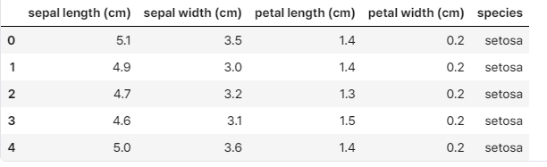
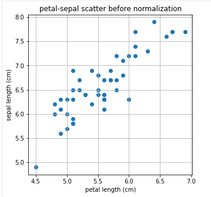
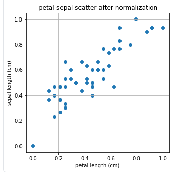
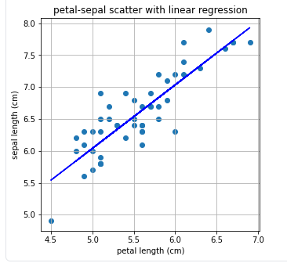

# Regularization
## 1. Regularization과 Normalization
### **Regularization**
*정칙화*라고 불린다.</br>
오버피팅을 해결하기 위한 방법 중 하나다.</br>
대표적인 정칙화에는 `L1 regularization`, `L2 regularization`, `Dropout`, `Batch Normalization` 등이 있다.</br>
```text
Overfitting?
- 과적합
- train set의 판별은 아주 잘함
- validation / test set 판변을 못함
```
#### 그래서 왜 Regularization을 하는건데?
1. 모델의 train loss를 증가시킴 (목적: prevent overfitting)
2. 1번의 수행으로 인해 validation loss나 test loss를 줄여줌

---

### *Normalization*
*정규화*라고 불린다.</br>
데이터의 형태를 모델 학습에 의미가 있도록 적합하게 전처리(pre-processing)하는 과정</br>
대표적인 정규화에는 `z-score normalization`, `minmax scalar normalization` 등이 있다.</br>
```text
[ z-score ]
  def.KR) 평균값의 표준편차에 대한 분수 표현

  def.EN) The Z-score, or standard score, is a fractional representation of standard deviations from the mean value.

[ minmax scalar ]
  def.KR) 수치적 특징을 가지는 값들을 0과 1사이의 범위를 가지는 실수로 바꾸어주는 데이터 전처리 기법

  def.EN) MinMaxScaler is a data preprocessing technique that transforms numerical features to a specific range (typically 0 to 1)
```
[About Z-score](https://deepai.org/machine-learning-glossary-and-terms/z-score)</br>

> Summary of lecture node
>> regulariztion은 오버피팅을 막고자 하는 방법</br>
>> normalization은 서로 범위가 다른 데이터들을 같은 범위로 바꾸어주는 데이터 전처리 과정</br>

---

코드 예제 [Iris Dataset](https://scikit-learn.org/stable/datasets/toy_dataset.html#iris-plants-dataset)</br>

<center>*normalization example code*</center></br>

Code Example1
```python
from sklearn.datasets import load_iris
import pandas as pd
import matplotlib.pyplot as plt

iris = load_iris()
iris_df = pd.DataFrame(data=iris.data, columns=iris.feature_names)
target_df = pd.DataFrame(data=iris.target, columns=['species'])

"""
0, 1, 2로 표현된 target data를 'setosa', 'versicolor', 'virinica'로 변경
"""
def converter(species):
    if species == 0:
        return 'setosa'
    elif species == 1:
        return 'versicolor'
    else:
        return 'virginica'

target_df['species'] = target_df['species'].apply(converter)

iris_df = pd.concat([iris_df, target_df], axis=1)
iris_df.head()
```
결과예시1</br>
<!-- 그림1 -->
</br>

---

Code Example2
```python
X = [iris_df['petal length (cm)'][a] for a in iris_df.index if iris_df['species'][a] == 'virginica']
Y = [iris_df['sepal length (cm)'][a] for a in iris_df.index if iris_df['species'][a] == 'virginica']

print(f"petal length(꽃잎 길이) {X}")
print(f"sepal length(꽃받침의 길이) {Y})
```
결과예시2</br>
```shell
petal length(꽃잎 길이) [6.0, 5.1, 5.9, 5.6, 5.8,
                        6.6, 4.5, 6.3, 5.8, 6.1,
                        5.1, 5.3, 5.5, 5.0, 5.1,
                        5.3, 5.5, 6.7, 6.9, 5.0,
                        5.7, 4.9, 6.7, 4.9, 5.7,
                        6.0, 4.8, 4.9, 5.6, 5.8,
                        6.1, 6.4, 5.6, 5.1, 5.6,
                        6.1, 5.6, 5.5, 4.8, 5.4,
                        5.6, 5.1, 5.1, 5.9, 5.7,
                        5.2, 5.0, 5.2, 5.4, 5.1]
sepal length(꽃받침의 길이) [6.3, 5.8, 7.1, 6.3, 6.5, 
                            7.6, 4.9, 7.3, 6.7, 7.2, 
                            6.5, 6.4, 6.8, 5.7, 5.8, 
                            6.4, 6.5, 7.7, 7.7, 6.0, 
                            6.9, 5.6, 7.7, 6.3, 6.7, 
                            7.2, 6.2, 6.1, 6.4, 7.2, 
                            7.4, 7.9, 6.4, 6.3, 6.1, 
                            7.7, 6.3, 6.4, 6.0, 6.9, 
                            6.7, 6.9, 5.8, 6.8, 6.7, 
                            6.7, 6.3, 6.5, 6.2, 5.9]
```

---

Code Exmaple3
```python
plt.figure(figsize=(5,5))
plt.scatter(X,Y)
plt.title('petal-sepal scatter before normalization')
plt.xlabel('petal length (cm)')
plt.ylabel('sepal length (cm)')
plt.grid()
plt.show()
```
결과예시3</br>
<!-- 그림2 -->
</br>

---

Code Example4
```python
## Do noramlization
from sklearn.preprocessing import minmax_scale

X_scale = minmax_scale(X)
Y_scale = minmax_scale(Y)

plt.figure(figsize=(5,5))
plt.scatter(X_scale,Y_scale)
plt.title('petal-sepal scatter after normalization')
plt.xlabel('petal length (cm)')
plt.ylabel('sepal length (cm)')
plt.grid()
plt.show()
```
결과예시4</br>
<!-- 그림3 -->
</br>

---

<center>*regularization example code*</center></br>

Code Example1
```python
from sklearn.linear_model import LinearRegressing
import numpy as np

X = np.array(X)
Y = np.array(Y)

# Train Iris Dataset via Linear Regression
linear= LinearRegression()
linear.fit(X.reshape(-1,1), Y)

# Check the slope and the intercept of Linear Regression
a, b=linear.coef_, linear.intercept_
print(f"기울기 : {a}, 절편 : {b}")
```
결과예시1
```shell
기울기 : 1.00, 절편 : 1.06
```

---

Code Example2
```python
plt.figure(figsize=(5,5))
plt.scatter(X,Y)
plt.plot(X,linear.predict(X.reshape(-1,1)), '-b')
plt.title('petal-sepal scatter with linear regression')
plt.xlabel('petal length (cm)')
plt.ylabel('sepal length (cm)')
plt.grid()
plt.show()
```
결과예시2</br>
<!-- 그림4 -->
</br>

---

Code Example3
```python
### 나머지 부분 추가 작성필요
```

## 2. L1 Regularization
<!-- 수학식 정의 정리 필요 -->
### Lp norm (참고지식)
`norm`은 벡터나 행렬, 함수 등의 거리를 나타내는 것이다.</br>
[WIKI-Lp norm](https://en.wikipedia.org/wiki/Norm_(mathematics))</br>

<!-- 나머지 추가 정리 필요-->

> Summary of lecture node
>> Linear regression과 L1, L2 regression의 차이 중 하나는 다음과 같다.</br>
>> 하이퍼파라미터가 하나 더 들어간다.</br>
>> 이는 error에 영향을 미친다.</br>

> partial of the chatGPT answer
>> 노드에서 언급한 `하이퍼파라미터`가 이해되지 않아 찾아본 것</br>
>>> Linear regression에는 패널티 항목(penalty term)이 없다.
>>> L1 regression에는 L1 norm으로 불리는 패널티 항목이 있는데 이는 `절대값`이다.
>>> L2 regression에는 L2 norm으로 불리는 패널티 항목이 있는데 이는 `제곱 값`이다.</br>

## 3. L2 Regularization
<!-- 추가정리 필요 -->

